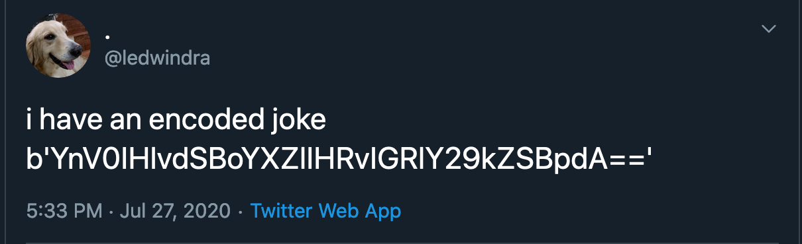

# About
A list of my daily lessons. I don't set high expectations here. My rationale is that building a good habit might not be easy. So let's just find out how this goes. I also haven't thought the best format for this repository so it will be just a simple markdown.

## Before 2020
Skipped.

# 2020 - July 1 - 26
It's been a rough year, isn't it? Anyway, skipped

## July 27, 2020
Today I learned how to encode a string in Python using [`base64`](https://docs.python.org/3/library/base64.html) built-in module. This question posted on [`stackoverflow`](https://stackoverflow.com/questions/8908287/why-do-i-need-b-to-encode-a-string-with-base64) helps me through it. Following is my main usage:

```
>>> import base64
>>> encode = 'but you have to decode it'.encode()
>>> base64.b64encode(encode)
b'YnV0IHlvdSBoYXZlIHRvIGRlY29kZSBpdA=='
```

[and then ...](https://twitter.com/ledwindra/status/1287697628268879877)



## July 28, 2020
Today I learned how to initiate `main` as a default branch on git! This article from [`GitHub`](https://github.blog/2020-07-27-highlights-from-git-2-28/#introducing-init-defaultbranch) helps me from updating git to version 2.28 to [creating a new repository](https://github.com/ledwindra/change-main-branch) with `main` branch, instead of `master`.

In addition, I managed to changed the default branch from existing project such as this repository  to `main`. [This article](https://www.hanselman.com/blog/EasilyRenameYourGitDefaultBranchFromMasterToMain.aspx) [and this StackOverflow post](https://stackoverflow.com/questions/2003505/how-do-i-delete-a-git-branch-locally-and-remotely) help me to make this happen. A small step worth doing indeed!

Following is the snippet from the command line:

```
ledwindra@R90SEMHV:~/today-i-learned$ git status
On branch main
Your branch is up to date with 'origin/main'.

Changes not staged for commit:
  (use "git add <file>..." to update what will be committed)
  (use "git restore <file>..." to discard changes in working directory)
        modified:   README.md

no changes added to commit (use "git add" and/or "git commit -a")
```


